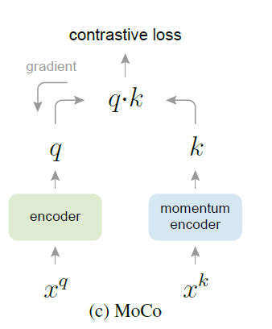
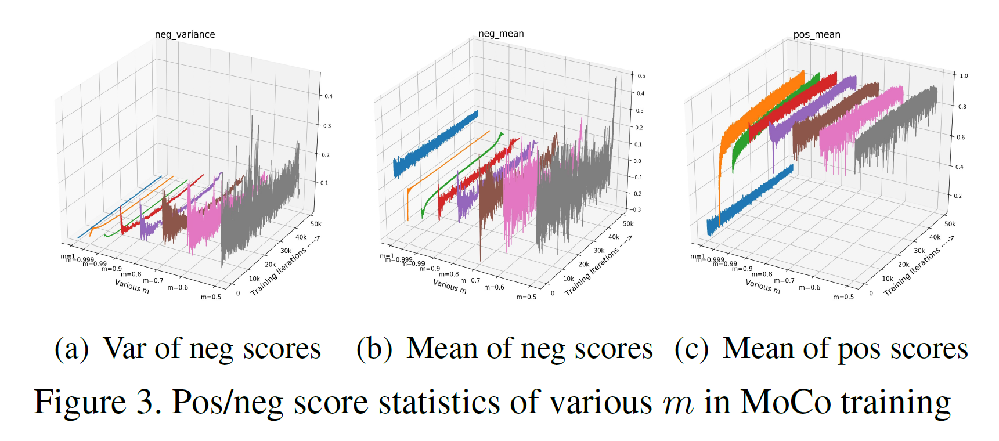
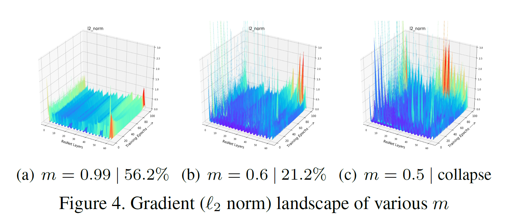
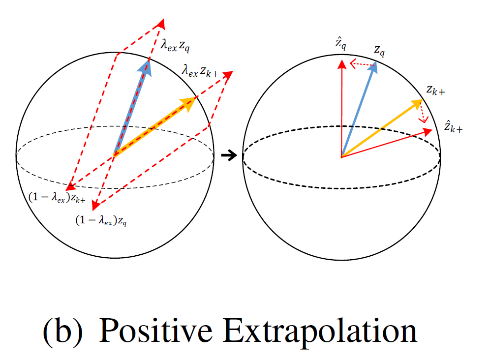
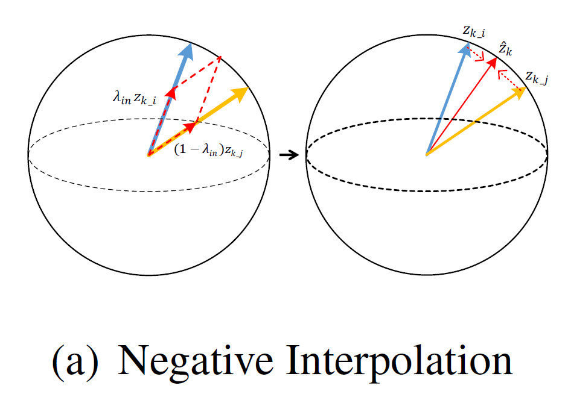

该论文为iccv2021自监督领域oral中的一篇。

# Improving Contrastive Learning by Visualizing feature Transformation

## 动机

以往自监督的对比学习方法，大多通过数据增强的方式来获得多种视图，但是数据增强的方式需要进行探索，并且不能直观上来保证一定有效。那么这篇论文首先通过实验证明：

- 负样本不应该有非常剧烈且明显的变化，对于训练过程中，负样本的变化应该是稳定且平滑的变化。
- 对于正样本对，他们之间的分数应该越小（代表困难正样本对）能够有效改善关于样本的表示。

作者通过一系列的实验图表证明上述两点对自监督学习的作用，并通过Feature Transformation的方法在特征层面进行增强，并且这种方式的可解释性比直接在图像上做数据增强可解释性较高。

## 可视化对比学习

作者在MoCo上做的实验以及相关的可视化。

### MoCo回顾

$$
\theta_{f_k}\leftarrow m\theta_{f_k}+(1-m)\theta_{f_q}
$$

### 发生模型坍塌的分析

作者通过实验发现，使m变小会带来更多的不一致性，即负样本变化太大，导致训练过程中梯度的变化也较大，这样就使模型很难收敛。

因此作者通过分析得出，负样本在训练过程中不能发生过于剧烈的变化，应该稳定平稳的进行变化。

### 困难正样本对能够有效改善模型的训练

把m变小，同时还能使得$f_q$和$f_k$变得更为相似，这样就会导致正样本对之间的距离变得很小，从而影响了模型能够学到更鲁棒的表达。

因此作者认为，通过增大正样本对之间的距离，使其变成困难样本能够让模型学到更鲁棒的表达。

## Feature Transformation

### 正样本外插

作者在论文中通过外插的方法，增大正样本对之间的距离。
$$
\hat{z}_q=\lambda_{ex}z_q+(1-\lambda_{ex})z_{k+}\\
\hat{z}_{k+}=\lambda_{z_{k+}}+(1-\lambda_{ex})z_q
$$
为了使得插值之后的的正样本对之间的距离进一步变远，应该使得$\lambda_{ex}\ge1$。作者在后面的实验过程中，还引入了一种非标量的$\lambda_{ex}$，同时还引入了向量级别的，也就是针对向量中的每一维都有一个对应的$\lambda_{ex}$。$\lambda_{ex}\sim Beta(\alpha_{ex},\alpha_{ex})$

### 负样本对插值

为了增加负样本对的多样性，通过将queue中的负样本进行线性插值的方法得到新的负样本：
$$
\hat{Z}_{neg}=\lambda_{in}\cdot Z_{neg}+(1-\lambda_{in})\cdot Z_{perm}
$$
其中$Z_{neg}$为queue中所有负样本，$Z_{perm}$为queue中负样本进行随机打乱后重组的负样本。$\lambda_{in}\sim Beta(\alpha_{in},\alpha_{in})$

## 实验

作者在实验中说明，当一开始就使用Feature Transformation会使得模型变得混乱，因此最好是在第二个epoch之后开始使用会更好。